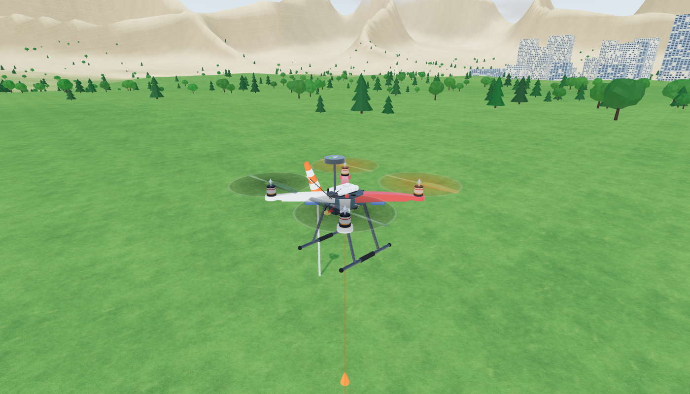

# ALbarajControl: F450 drone simulator in your browser

**▶ Open the simulator: https://mhmdsalemm100.github.io/ALbarajControl/**

A Gazebo-style 3D simulator for a **DJI F450 quadcopter** that runs entirely in a web page. You can:

* **fly immediately in simulation mode** with the keyboard, a gamepad, a USB RC transmitter or touch sticks. No hardware needed.
* **plug in your Pixhawk + RC receiver** and fly the virtual F450 with **your real remote controller**.
* run **true hardware-in-the-loop (HITL)**: the PX4 flight stack on your Pixhawk flies the simulated drone. The page sends it simulated IMU, magnetometer, barometer and GPS data, and reads back its motor outputs.
* use the built-in **ground control station, similar to QGroundControl** (the purple **Q** button): map, vehicle status, flight modes, arm / takeoff / land / return, *go to location*, **mission planning with upload and start**, a MAVLink inspector, live charts and message logs.



## Features

| | |
|---|---|
| **3D world** | Three.js with physically based materials, sky & sun model, soft shadows, ACES tone mapping. Procedural terrain with mountains, a lake, forests, a town, an airfield with runway, hangars, tower and helipad, a windsock and clouds. Time of day, wind and gusts. Quality presets up to *Ultra*. Screenshot button saves a double-resolution PNG. |
| **F450 model** | True-scale Flame Wheel frame (red front / white rear arms), PCB power board, 2212 motors, 10×4.5 props with motion-blur discs, Pixhawk, GPS mast, receiver, ESCs, 3S LiPo, tall landing gear and navigation LEDs. |
| **Physics** | 6-DOF rigid body at 500 Hz. Quad-X motors with ESC lag, thrust and yaw torque, battery sag, linear and quadratic drag, wind and gusts, ground contact and crash detection. Mass, inertia and thrust match a real F450 (1.25 kg, ~2.7:1 thrust-to-weight). |
| **Autopilot (sim mode)** | PX4-style cascade (position → velocity → attitude → rate → mixer). Modes: Acro, Stabilized, Altitude, Position, Hold, Takeoff, Land, Return, Mission. |
| **Pixhawk link** | MAVLink v2 over **Web Serial** (Chrome/Edge) or a **WebSocket bridge**. Reads heartbeat, attitude, position, RC channels, battery, status text and mission messages. Sends commands, PX4 and ArduPilot mode changes, and runs the mission upload/download protocol. For HITL it sends `HIL_SENSOR` at 250 Hz and `HIL_GPS` at 10 Hz and receives `HIL_ACTUATOR_CONTROLS`. |
| **Ground station** | Fly view (map + 3D picture-in-picture, like QGC), Plan view (click to add waypoints, drag, takeoff / land / RTL / loiter / speed items, orbit and survey generators, save/open **QGroundControl `.plan` files**), Analyze (MAVLink inspector, charts, log), Setup (RC mapping & calibration, gamepad axes, weather, home location, autopilot limits). |

## Quick start

1. Open **https://mhmdsalemm100.github.io/ALbarajControl/** in Chrome or Edge.
2. Press **T** to take off. Fly with **W/S** (throttle), **A/D** (yaw) and the **arrow keys** (pitch/roll). Press **H** to return home, **F1** for all keys.
3. Click the purple **Q** icon (or press **Q**) to open the ground control station. In **Plan**, click the map to add waypoints, then press **Start mission**.

### With your Pixhawk and remote controller

Plug the receiver into the Pixhawk, and the Pixhawk into the PC with USB. Close QGroundControl, then click **Connect Pixhawk**:

* **RC controller mode**: your transmitter flies the simulator. Works with any PX4 or ArduPilot firmware.
* **Hardware-in-the-loop (PX4)**: the Pixhawk's own flight controller flies the simulator. You must set `SYS_HITL=1` and the *HIL Quadcopter X* airframe once.
* **Telemetry only**: watch the real board's attitude and data.

The full step-by-step guide with troubleshooting is in **[docs/HITL_SETUP.md](docs/HITL_SETUP.md)**.

## Publishing the web page (GitHub Pages)

The workflow in `.github/workflows/pages.yml` runs the tests and publishes the site on every push to `main`. You only need to switch it on once:

1. On GitHub, open **Settings → Pages**.
2. Under **Build and deployment → Source**, choose **GitHub Actions**.
3. Merge or push to `main`. After about a minute the simulator is live at `https://mhmdsalemm100.github.io/ALbarajControl/`. The link also appears in the repository's *Deployments* / *Environments → github-pages* section.

## Running locally

Everything is static files. Three.js and Leaflet are vendored in `vendor/`, so there is no build step:

```bash
npm start            # serves http://localhost:8080
npm test             # MAVLink codec tests + headless flight test (physics + autopilot + mission)
```

Web Serial only works on `https://` pages or on `http://localhost`.

Optional tools:

* `bridge/`: Node WebSocket ⇄ UDP/serial bridge for PX4/ArduPilot SITL, Firefox/Safari, or running real QGroundControl alongside ([bridge/README.md](bridge/README.md)).
* `tools/mock-pixhawk.mjs`: a fake PX4 in HITL mode for testing without hardware.
* `tools/gen_mavlink.py`: regenerates `js/mavlink/messages.js` from pymavlink.

## Project structure

```
index.html              app shell (toolbar, fly tools, instruments, GCS panels, dialogs)
css/app.css             QGroundControl-style dark UI
js/main.js              app wiring: physics loop, HITL I/O, UI, hotkeys, connection flow
js/core/                vector/quaternion math, geodesy (NED <-> lat/lon, ISA atmosphere)
js/sim/quadcopter.js    F450 6-DOF physics, motors, battery
js/sim/sensors.js       IMU / magnetometer / barometer / GPS models (noise, bias, drift)
js/sim/autopilot.js     internal flight controller, flight modes, mission executor
js/input/input.js       keyboard, gamepad / USB transmitter, touch sticks, RC via Pixhawk
js/mavlink/             MAVLink v2 codec + generated message definitions
js/link/                Web Serial & WebSocket transports, MAVLink vehicle (commands, missions, HIL)
js/render/              Three.js scene, cameras, world, F450 model, procedural textures
js/ui/                  ground station (map, planner, analyze, setup), instruments
bridge/                 optional Node.js MAVLink bridge
docs/                   hardware setup guide, images
tests/                  node tests
```

## About FlightGear / Gazebo assets

FlightGear aircraft and scenery are GPL-licensed and stored in formats (AC3D, BTG) that browsers can't load directly. Gazebo worlds need a native server. To keep the page fast, license-clean and working offline, **every model and texture here is generated in code**: the F450, terrain, trees, buildings and runway. glTF models can be added later with Three.js' `GLTFLoader` if you want to import your own assets.

## Licenses

Code: MIT. Bundled libraries: [three.js](https://threejs.org) (MIT, `vendor/three/LICENSE`), [Leaflet](https://leafletjs.com) (BSD-2, `vendor/leaflet/LICENSE`). Map tiles © Esri / © OpenStreetMap contributors. MAVLink message definitions are generated with pymavlink (LGPL); the generated tables contain protocol constants only.
